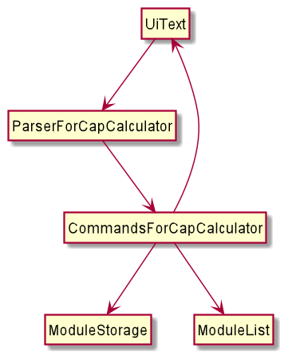
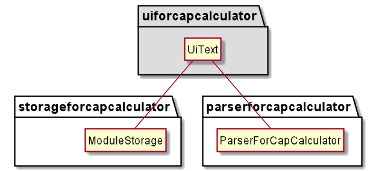
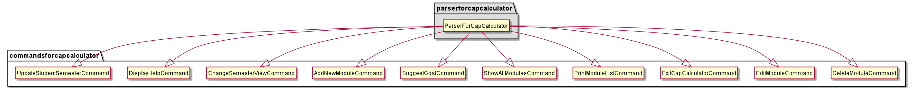
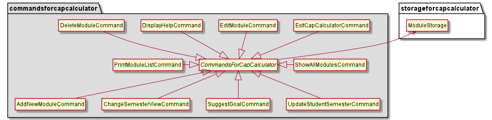
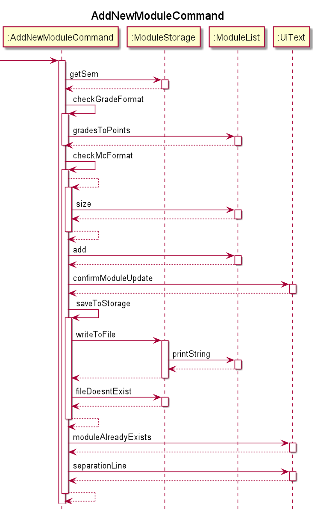
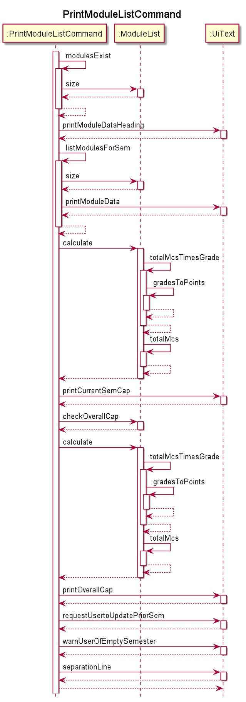
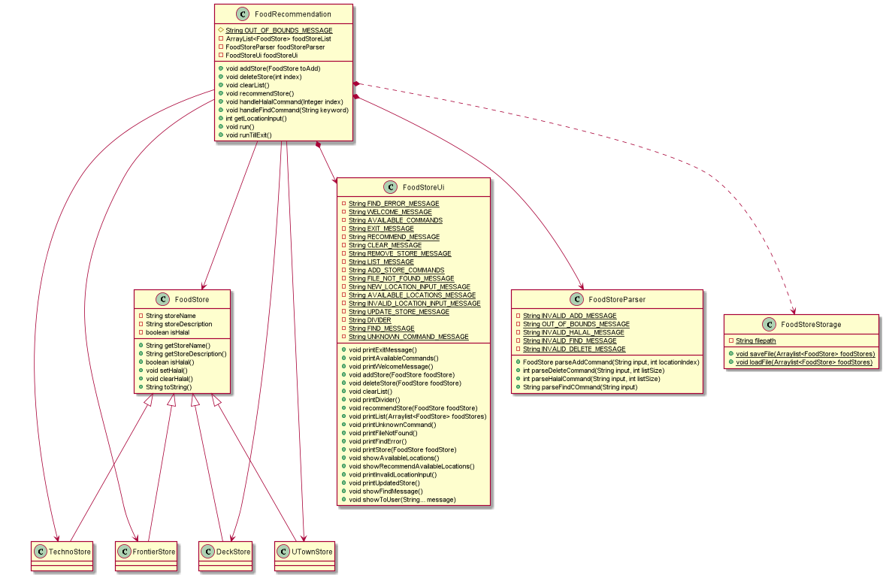

# Developer Guide

## Introduction

All-in-OneNUS is a Command Line Interface(CLI) application that aims to help students with their university lives. All-in-OneNUS has 4 components, Team Planner, CAP Calculator, Module Planner and Food Recommendation App. 

## Overall Design

The AllinOneNus class contains the main method of the program, which will call the run() method from the OverallParser class. From there, the user can then access the 4 components of the application, whereby inputting a number from 1-4 will call the respective classes.

***
***
### Team Planner
***
#### Design

***
#### Implementation
***
***
### CAP Calculator
***
#### Design
Architecture

The Architecture Diagram given above explains the high-level design of the CAP Calculator. Given below is a quick overview of each component.

1. UiText

* The UiText component manages interactions with the user and contains the methods to output 
to the user interface on the command line.

2. ParserForCapCalculator 

   
* The ParserForCapCalculator component sieves out all the different commands based on the user input
and passes it to CommandsForCapCalculator Component

3.  CommandsForCapCalculator

* The CommandsForCapCalculator component executes the different tasks the CapCalculator is capable of doing.
More will be elaborated in **this section**

4. ModuleList
  
* ModuleList handles computation, calculation and logic for CapCalculator

5. ModuleStorage

* The ModuleStorage component writes data to, and loads data from the hard disk

##### UiText Component

#### ParserForCapCalculator Component

#### CommandsForCapCalculator Component

#### ModuleStorage Component

#### ModuleList Component

***

#### Implementation

This section describes some unique details on how certain features are implemented

#### Add 

A general explanation of how this feature works:

1. When the user calls this feature by adding in his module data (e.g. CS2113T A 4)
2. The AddNewModuleCommand calls ModuleList#gradesToPoints() method which handles the logic of converting
the grades to points. So in this case A is translated to a 5.00.
3. It thens calls ModuleList#add method to add the moduleData to the list of modules.
4. It then calls UiText#moduleAlreadyUpdate() to inform the user that the input is verified and added.
5. AddNewModuleCommand then calls ModuleStorage#writeToFile() to store the updated data to hard disk.

#### PrintModuleList

A general explanation of how this feature works:

1. When the user calls this feature by requesting for "list" in the user interface
2. The PrintModuleListCommand calls UiText#printModuleData() to display the list of modules in the current semester
3. The PrintModuleListCommand starts and calls ModuleList#calculate() method twice which handles the logic of 
   computing the current semester CAP and the overall CAP respectively.
4. It then calls ModuleList#printCurrentSemCap and ModuleList#printOverallCap to display
the current semester's CAP and the overall CAP respectively.
   
>The calculation of the cap is given by this formula:
> 
> 
> 
>This is handled by ModuleList#calculate() which also self invocates ModuleList#totalMcsTimesGrade(), 
> ModuleList#totalMcs() in order to output the correct computation

***
***
### Module Planner
***
#### Design

***
#### Implementation
***
***
### Food Recommendation App
***
#### Design

The Architecture Diagram shown above explains the high-level design of the Food Recommendation feature. 
There are 5 main components to the feature.

1. FoodRecommendation

* This is the main class of the Food Recommendation Feature. It contains all the methods for all the commands.
  It also handles the user input, stores the FoodStore class in an Arraylist, and is responsible for calling the methods
  for all the other classes. It creates an instance of FoodStoreUi and FoodStoreParser.
  
2. FoodStoreUi

* The FoodStoreUi class is responsible for all the outputs to the user. It contains all the methods required to show any
output to the user.

3. FoodStoreParser

* The FoodStoreParser class is responsible for parsing all the inputs from the user into the correct arguments for the 
methods in FoodRecommendation class.
  
4. FoodStoreStorage

* The FoodStoreStorage class is responsible for saving and loading the FoodStore class into a single `.txt`file. 
It will create a new `.txt` file if there is no such file to be found.
  
5. FoodStore

* The FoodStore class contains all the information about a food store that the user inputs. It contains all the methods 
to retrieve any information about the store. There are 4 classes that inherits from the FoodStore class, which is the 
  main class. The 4 classes are DeckStore, FrontierStore, TechnoStore and UTownStore.

***
#### Implementation

***
***

## Product scope
### Target user profile:

 * Prefers using CLI apps

 * Is a student of NUS

 * Needs to manage a team
 
 * Requires more insights on the modules they are taking

 * Tend to be food savvy 

### Value proposition

* Have all the relevant student obligations and desires managed at a single location

## User Stories

| Version  | Tool | As a ... | I want to ... | So that I can ...|
|---|---|----------|---------------|------------------|
|v1.0|CAP Calculator|student| add my modules and grades on a platform | store additional module information in a convienent place|
|v1.0|CAP Calculator|student| view my modules I am taking in the current semester | view my overall and semester CAP |
|v1.0|CAP Calculator|student|delete module data|remove erroneous inputs|
|v1.0|CAP Calculator|student|edit module data| simulate my overall and semester CAP based on academic ability|
|v1.0|CAP Calculator|student|exit CAP Calculator| use other tools in All-in-OneNUS|
|v1.0|CAP Calculator|student|request help within CAP |navigate the app better|
|v1.0|CAP Calculator|student|change the semester I am viewing|view my module data in a different semester|
|v1.0| |food savvy individual|view my food options|make better choices when selecting places to eat|
|v1.0| |team leader|view the team members at one glance|manage my team better|
|v1.0| |team leader|track the tasks that have been completed|ensure deliverables are completed on time|
|v1.0| |team leader|exclusively be able to add and delete members|ensure that the members list is updated and accurate|
|v1.0| |team leader|delegate tasks to my team members|distribute the work evenly|
|v1.0| |team member|track team members progress|ensure that I do not do a task that has already been completed|
|v1.0| |team member|mark a task as completed|inform my team members that the task has been completed|
|v1.0| |team member|view at one glance which tasks are more important|prioritise my tasks efficiently|
|v1.0| |student|gather more insights about modules offered|know if I stand a chance in getting that module|
|v2.0|CAP Calculator|student|display all my module data|view all my modules at a glance|
|v2.0|CAP Calculator|student|update my student year status|update my module data when I commence to the next semester|
|v2.0|CAP Calculator|student|know what my semester CAP has to be|achieve the desired overall CAP|

## Non-Functional Requirements

{Give non-functional requirements}

## Glossary

* *glossary item* - Definition

## Instructions for manual testing

{Give instructions on how to do a manual product testing e.g., how to load sample data to be used for testing}
